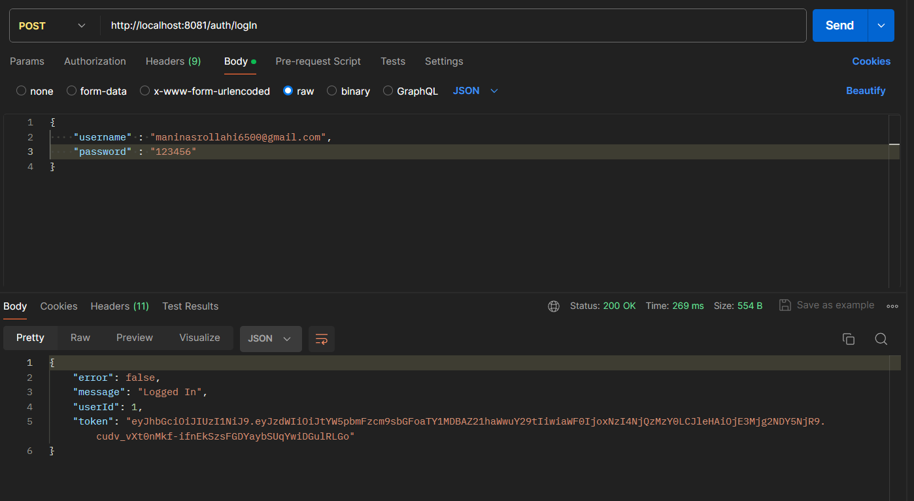
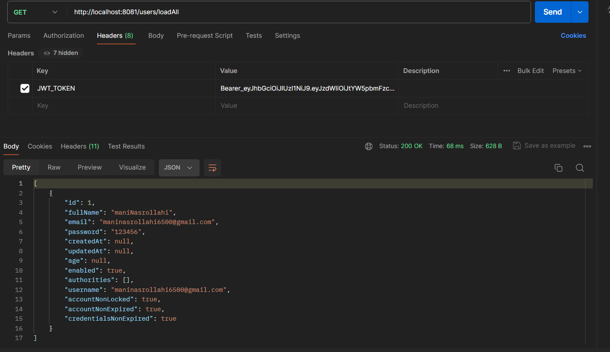

# Spring Boot 3 + Security + JWT : Token Based Authentication Example

[](https://docs.oracle.com/en/java/javase/22/)
[](https://spring.io/projects/spring-boot)
[](https://spring.io/projects/spring-security)
[](https://github.com/jwtk/jjwt)
[](https://racle.com)


This repository contains a example of token-based authentication using Spring Boot, Spring Security, and JSON Web Tokens (JWT). It includes integration with Spring Data JPA for database interactions and Oracle as the underlying database.

## Features

- **Token-based Authentication**: Secure your Spring Boot application using JSON Web Tokens.
- **Spring Security Integration**: Leverage Spring Security for robust authentication and authorization.
- **Spring Data JPA with Oracle**: Store and retrieve user information using Spring Data JPA with Oracle database.
- **Maven Build**: Simplify project management and dependency resolution with Maven. 
## Prerequisites

- Java 22
- Maven
- Oracle 11g

## Getting Started

1. Clone the repository:

   ```bash
   git clone https://github.com/maninasrollahi/SpringBoot-SpringSecurity-Jwt-Athentication.git
   ```

2. Navigate to the project directory:

   ```bash
   cd SpringBoot-SpringSecurity-Jwt-Athentication
   ```

3. Configure Oracle database properties in `src/main/resources/application.properties`.

4. Build and run the application:

   ```bash
   mvn spring-boot:run
   ```

5. Get authentication token : [http://localhost:8081/logIn](http://localhost:8081/logIn)
 
 (the username and password must be sent in requests body)
7. Test authentication token : [http://localhost:8081/users/loadAll](http://localhost:8081/users/loadAll)
  
 (the token must be in the requests header with the name of JWT_TOKEN and it must start with Bearer_)

## Contributing

Contributions are welcome! Feel free to open issues and pull requests.
